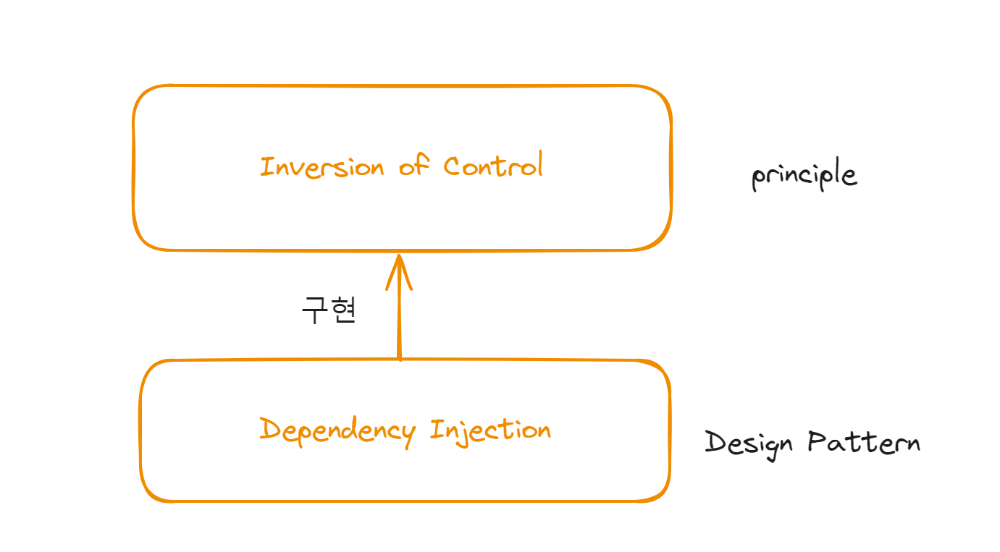
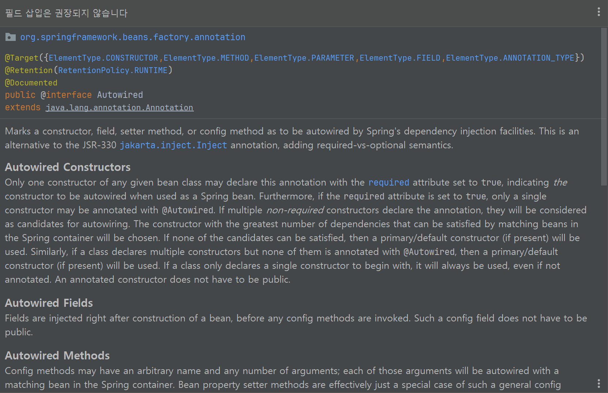
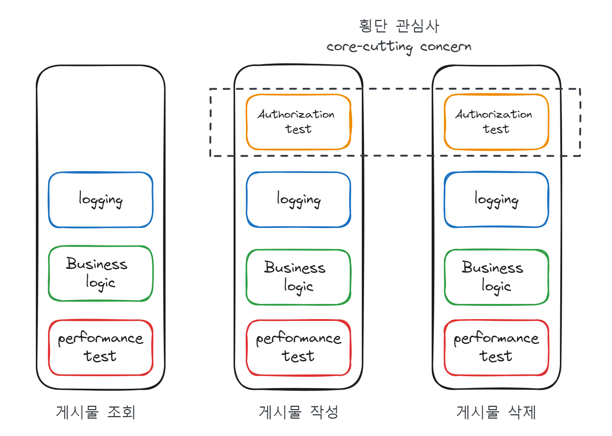
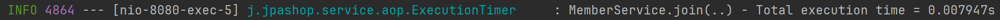
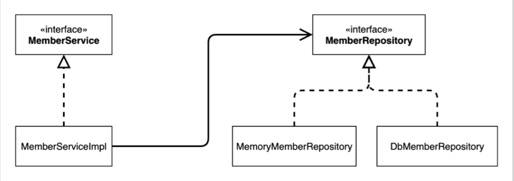
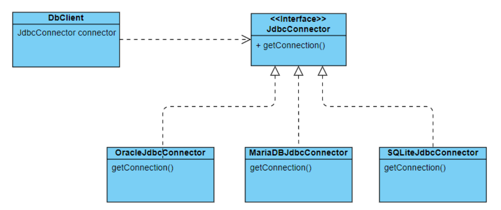
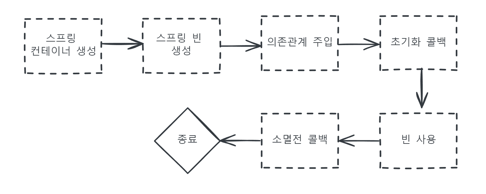
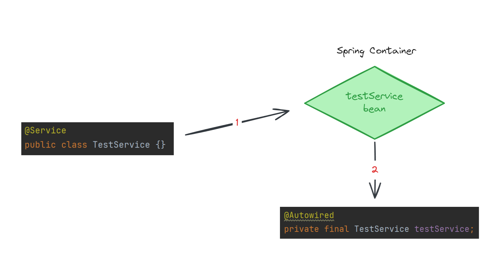
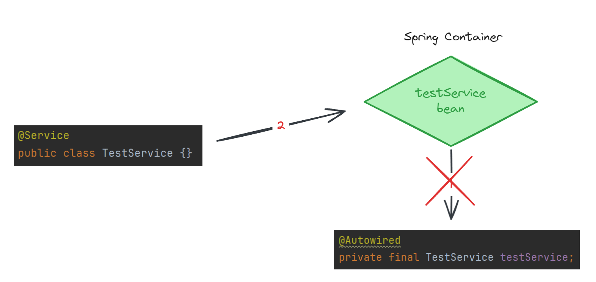
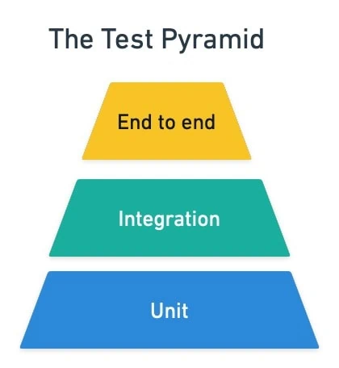

# ✅ IoC/DI
### IoC와 DI의 관계


IoC는 코드 간 결합도를 낮추고 유지보수성을 증가시키기 위한 원칙(Principle)이고 DI는 이를 구현하려는 디자인 패턴이다.

### Inversion Of Control

우리 말로 번역하면 ***제어의 역전*** 정도가 되겠다.

> Don't call us, we will call you.
>
> 헐리우드 원칙(Hollywood Principle)

이러한 원칙을 프로그래밍에 적용하게 되면,

저수준 구성요소는 고수준 구성요소를 호출할 수 없게 되고

고수준 구성요소가 필요할 때 저수준을 호출하게 된다.

**IoC는 메소드나 객체의 호출을 개발자가 결정하는 것이 아니라 외부에서 결정하자는 원칙이다**

특히 스프링 프레임워크가 이를 관리하며 의존성 객체를 생성해
필요한 곳에 주입시켜주는 방식을 취한다.

> 💡 프레임워크와 라이브러리의 차이점
>
> 프레임워크는 라이브러리의 메소드를 적절한 시점에서 호출해 사용하도록 돕는다.
>
> 즉 라이브러리는 단순 활용가능한 도구들의 집합이고,
> 이에 대한 제어를 외부로 돌리는 IoC가 적용된 것이 프레임워크이다.

***
### Dependency Injection
의존성 주입은 IoC를 실현하기 위한 디자인 패턴이다.

IoC의 하위 개념으로 생각할 수 있겠다.

DI를 적용하므로써, 객체 간 결합도를 줄이고 확장성을 높힐 수 있다.

대표적으로 세 가지 방식으로 DI를 구현한다.

```
// 1. setter를 통한 주입
@Service
public class TestService {
    private final List<Test> testList;
    
    @Autowired
    public void setTests(List<Test> tests) {
        this.testList = tests;
    }
    ...
}

// 2. 생성자를 통한 주입
@Service
public class TestService {
    private final List<Test> testList;

    @Autowired
    public TestService(List<Test> testList) {
        this.testList = testList;
    }
	...
}

// 3. 필드 주입
@Service
public class TestService {
    
    @Autowired
    private final List<Test> testList;
	...
}
```

이 중 가장 권장되는 방식은 ***생성자를 통한 주입***이다.
***
먼저 필드 주입은 IDE에서도 WARNING을 발생시킨다.



외부에서 변경이 불가능해 테스트하기 어렵다는 단점이 있기 때문이다.
***
setter를 통한 방식도 잘 사용되지 않는다.

의존관계를 변경될 수 있기 때문이다.
대부분의 의존관계는 애플리케이션 종료 전까지 변할 일이 없으며,
setter를 통한 주입을 하려면 public 메서드로 선언해야하는데,
변경하면 안되는 것을 접근할 수 있게 두는 것은 좋은 설계가 아니다.

***
그래서 생성자 주입을 사용한다.

객체를 생성할 때 딱 1번만 호출되고 이후에 호출되는 일이 없으므로 불변하게 설계할 수 있으며, 생성자에 원하는 객체를 넘겨 의존관계를 객체를 생성하며 다양하게 설정할 수 있다.

# ✅ AOP

### AOP란?
AOP는 Aspect-Oriented Programming의 약자로

비즈니스 로직과 공통 관심사를 분리하는 프로그래밍 패러다임이다.

### 왜 필요한가?

AOP를 설명하는 가장 유명한 예시를 가져와봤다.

IT 회사에 근무중인 형준에게 다음과 같은 지시가 내려왔다.

***"회원가입에 걸리는 시간을 측정해 로그로 남겨주세요"***

```
public Long join(Member member) {
        validateDuplicateMember(member); //중복 회원 검증
        memberRepository.save(member);
        return member.getId();
    }
```

형준은 이렇게 작성되었던 코드를

```
public Long join(Member member) {
        StopWatch stopWatch = new StopWatch();
        stopWatch.start();
        try {
        	validateDuplicateMember(member); //중복 회원 검증
        	memberRepository.save(member);
        } finally {
            stopWatch.stop();
            log.info("join spent {} ms", stopWatch.getLastTaskTimeMillis());
        }
        return member.getId();
    }
```

다음과 같이 수정했다.

한 건 해냈다는 마음으로 보고를 하니 다음과 같은 추가지시가 내려온다.

"이런 로그를 모든 비즈니스 로직에 적용해주면 좋겠어요"

현재 애플리케이션에 존재하는 로직이 백만개가 넘어갔기 때문에

눈앞이 아득해진 형준은 다음날 사직서를 제출한다...

***

위와 같은 상황의 문제는 무엇일까

1. 일일이 모든 로직에 코드로 작성해야한다. (사실상 불가능)
2. 서비스에 비즈니스 로직과 부가기능이 결합된다. (유지보수 및 가독성 낮아짐)

이와 같은 상황을 AOP를 적용하므로써 해결해보자.

### 횡단 관심사



각 기능에 중복되는 부가 기능을 횡단 관심사라고 한다.

우리의 목표는 횡단 관심사를 비즈니스 로직과 분리하면서

부가기능이 작동하도록 하는 것이다.

### 적용 예시

```
@Target({ElementType.METHOD, ElementType.ANNOTATION_TYPE})
@Retention(RetentionPolicy.RUNTIME)
public @interface ExeTimer {
}

```
이제 메소드에 @ExeTimer만 붙이면 실행시간을 측정해서 로그로 남기도록 할 것이다.

```
@Slf4j
@Aspect
@Component
public class ExecutionTimer {

    @Pointcut("@annotation(jpabook.jpashop.service.aop.ExeTimer)")
    private void Timer(){}

    @Around("Timer()")
    public Object traceTime(ProceedingJoinPoint joinPoint) throws Throwable{
        StopWatch stopWatch = new StopWatch();

        try {
            stopWatch.start();
            return joinPoint.proceed();
        } finally {
            stopWatch.stop();
            log.info("{} - Total execution time = {}s",
                    joinPoint.getSignature().toShortString(), stopWatch.getTotalTimeSeconds());
        }
    }
}
```

타켓은 ExeTimer 어노테이션을 가지는 메소드이며

Advice는 실제 타켓 호출 전후에 실행되어야 하므로 Around 어노테이션을 설정했다.

실제 타켓이 호출되기 전 시간을 측정해 종료되면 시간측정을 종료하고 info 로그로 기록한다.
```
public Long join(Member member) {
        StopWatch stopWatch = new StopWatch();
        stopWatch.start();
        try {
        	validateDuplicateMember(member); //중복 회원 검증
        	memberRepository.save(member);
        } finally {
            stopWatch.stop();
            log.info("join spent {} ms", stopWatch.getLastTaskTimeMillis());
        }
        return member.getId();
    }
```
이랬던 코드가

```
@Transactional
@ExeTimer
public Long join(Member member) {
        validateDuplicateMember(member); //중복 회원 검증
        memberRepository.save(member);
        return member.getId();
    }
```

어노테이션만 붙여도 같은 동작을 하도록 수정되었다.



정상적으로 로그가 출력되는 것을 확인할 수 있다.

# ✅ PSA

### PSA란?

***Portable Service Abstarct***의 약자로 추상화 계층을 활용해 내부를 추상화하여 개발자에게 편의성을 제공하는 기술을 의미한다.

### Service Abstract

서비스 추상화는 구현체에 관계없이 인터페이스를 통해 확장성을 높히고 편의성을 제공한다.

POJO로 구현된 코드는 특정 기술을 외부로 노출해서는 안된다.

이를 해결하기 위해 Spring에서 제공하는 기술이 PSA이다.

즉 PSA를 통해 우리는 특정한 세부적인 기술에 종속되지 않도록 코드를 작성할 수있다.

### 예시



위 다이어그램은 회원에 어떻게 접근하는 지를 도식화한 그림이다.

현재 `MemberRepository`를 인터페이스로 `MemoryMemberRepository`와 `DbMemberRepository`를 구현체로 사용한다.

PSA 관점에서 보면 특정 기술에 대한 일관적인 접근 방식을 제공해야하고 이를 ***잘 구현된 인터페이스***로 제공한다.

즉 구현체에 크게 상관없이 Repository에 접근할 수 있는 것이다.



마찬가지로 java에서 클라이언트와 Database가 소통하는데 Jdbc를 사용한다.

`Dbclient`는 Oracle, Maria, SQLite 라는 기술을 직접 연결해서 사용하는 것이 아니라 `JdbcConnector`라는 인터페이스를 통해 간접적으로 연결한다.

어떤 구현체를 사용하더라도 `getConnect()` 메소드를 통해 일관적인 방식으로 접근할 수 있으며 클라이언트는 내부 기술을 추상화된 상태로 사용할 수 있게 한다.

# ✅ Spring Bean and LifeCycle
### Spring Container
```
ApplicationContext applicationContext =
new AnnotationConfigApplicationContext(AppConfig.class);
```

ApplicationContext를 스프링 컨테이너라 한다.

이렇게 생성된 컨테이너는 등록된 자바 객체를 관리한다.

이때 자바 객체를 스프링은 Bean이라고 부른다.

1. Bean의 생명주기 (빈의 인스턴스화, 할당, 제거)를 관리한다.
2. DI를 통해 애플리케이션의 컴포넌트를 관리한다.
3. 서로 다른 Bean들을 연결한다.

이를 통해 객체간의 의존도와 결합도를 낮추고 높은 캡슐화를 제공한다.

### Spring Bean

앞서 살펴봤다시피 스프링 빈은 자바 객체이며

스프링 컨테이너에 의해 관리되는 ***재사용***이 가능한 컴포넌트이다.

@Bean을 통해 메소드로부터 반환되는 객체를 스프링 빈으로 등록할 수 있다.

### Spring Bean LifeCycle

스프링 빈은 간단하게 다음과 같은 라이프사이클을 가진다.

**객체 생성 -> 의존관계 주입**

스프링 빈은 객체가 생성되고 의존관계가 주입된 이후부터 데이터를 사용할 준비를 마친다.

즉 초기화 작업은 이러한 DI 작업이 완료된 이후에나 호출해야한다.

**이러한 호출 시점을 스프링 컨테이너가 알려준다.**

스프링 빈의 이벤트 라이프사이클은 다음과 같다.



스프링은 의존관계가 주입되면 스프링 빈에게 콜백 메서드를 통해

초기화 시점을 알려준다.

* **초기화 콜백** : 빈이 생성되고, 의존관계 주입이 완료된 후 호출
* **소멸전 콜백** : 빈이 소멸되기 직전에 호출

이를 `@PostConstruct` , `@PreDestroy` 를 통해 간편하게 초기화와 종료를 실행할 수 있다.

> 💡 이러한 어노테이션 방식은 순수 자바 기술이라는 장점이 있지만
> 외부 라이브러리에는 사용할 수 없다는 단점이 있다.
> 외부 라이브러리에서 초기화, 소멸전 콜백을 사용해야한다면
>`@Bean`의 `initMethod`와 `destoryMethod`를 사용하자

# ✅ Spring Annotations
### 어노테이션이란?

> Annotations, a form of metadata, provide data about a program that is not part of the program itself.
>
Annotations have no direct effect on the operation of the code they annotate.

자바 공식 문서(https://docs.oracle.com/javase/tutorial/java/annotations/)
에 따르면 어노테이션은 메타데이터이며, 코드에는 영향을 미치지 않는다고 한다.

어노테이션의 사전적 정의는 ***주석*** 이며 실제 데이터가 아닌
데이터의 데이터 즉 메타데이터이다.

* Information for the compiler — Annotations can be used by the compiler to detect errors or suppress warnings.

* Compile-time and deployment-time processing — Software tools can process annotation information to generate code, XML files, and so forth.

* Runtime processing — Some annotations are available to be examined at runtime.

어노테이션의 용도는 3가지가 있으며

* 컴파일러에 대한 정보

* 컴파일 및 배포 시간 처리

* 런타임 처리

이다.

### 어노테이션의 정의

어노테이션을 정의하기 위해선 다양한 요소가 필요하다.

1. `@Retention` : 어노테이션의 동작 범위를 지정한다.

Enum 타입인 `RetentionPolicy`을 열어보면 다음과 같이 작성되어 있다.
```
public enum RetentionPolicy {
    /**
     * Annotations are to be discarded by the compiler.
     */
    SOURCE,

    /**
     * Annotations are to be recorded in the class file by the compiler
     * but need not be retained by the VM at run time.  This is the default
     * behavior.
     */
    CLASS,

    /**
     * Annotations are to be recorded in the class file by the compiler and
     * retained by the VM at run time, so they may be read reflectively.
     *
     * @see java.lang.reflect.AnnotatedElement
     */
    RUNTIME
}
```
* SOURCE : 컴파일 시간에 동작하지 않고 소스에서 표시만 된다.

* CLASS : 컴파일 시간에 동작하지만 런타임에서는 동작하지 않는다.

* RUNTIME : 런타임에서 동작한다. 실제로 많이 사용한다.

```
@Retention(RetentionPolicy.RUNTIME)
```

이런 방식으로 어노테이션의 동작 범위를 지정할 수 있다.

2. `@Target` : 어노테이션의 작용 범위를 지정한다.

Target의 범위를 작성해놓은 Enum 타입인 `ElementType`의 내용은 다음과 같다.

```
public enum ElementType {
    /** Class, interface (including annotation interface), enum, or record
     * declaration */
    TYPE,

    /** Field declaration (includes enum constants) */
    FIELD,

    /** Method declaration */
    METHOD,

    /** Formal parameter declaration */
    PARAMETER,

    /** Constructor declaration */
    CONSTRUCTOR,

    /** Local variable declaration */
    LOCAL_VARIABLE,

    /** Annotation interface declaration (Formerly known as an annotation type.) */
    ANNOTATION_TYPE,

    /** Package declaration */
    PACKAGE,

    /**
     * Type parameter declaration
     *
     * @since 1.8
     */
    TYPE_PARAMETER,

    /**
     * Use of a type
     *
     * @since 1.8
     */
    TYPE_USE,

    /**
     * Module declaration.
     *
     * @since 9
     */
    MODULE,

    /**
     * Record component
     *
     * @jls 8.10.3 Record Members
     * @jls 9.7.4 Where Annotations May Appear
     *
     * @since 16
     */
    RECORD_COMPONENT;
}
```
위의 Type들을 지칭해서 해당 어노테이션이 어디에 적용 가능한 지 제한할 수 있다.

```
@Target(ElementType.ANNOTATION_TYPE)
```
현재 어노테이션은 어노테이션에만 적용 가능하도록 제한하고 있다.

3. `@Documented` : javadoc에 어노테이션에 대한 설명을 빼도록 도와준다.

> @Documented annotation indicates that whenever the specified annotation is used those elements should be documented using the Javadoc tool. (By default, annotations are not included in Javadoc.) For more information
>
> _- Java Document -_

***

### 스프링에서 빈을 등록하는 과정 with @

우리는 어떻게 자바 객체를 스프링 빈으로 등록해 사용할까?

`@Service` , `@Repository`, `@Controller`, `@Component` 같은 어노테이션만 붙이면 스프링이 알아서 빈으로 등록해 호출해주는 과정을 알아보자.

`@Component`는 해당 클래스를 스프링 빈으로 등록하겠다는 의미이다.

```
public @interface Component {

	/**
	 * The value may indicate a suggestion for a logical component name,
	 * to be turned into a Spring bean name in case of an autodetected component.
	 * @return : the suggested component name, if any (or empty String otherwise)
	 */
	String value() default "";

}
```
`value =` 를 통해 특정 이름으로 지정할 수도 있다.

`@Component`는 `@Service` , `@Repository`, `@Controller`에 포함되어 있다.

```
@Target(ElementType.TYPE)
@Retention(RetentionPolicy.RUNTIME)
@Documented
@Component
public @interface Controller {

	/**
	 * Alias for {@link Component#value}.
	 */
	@AliasFor(annotation = Component.class)
	String value() default "";

}
```

위에서 살펴본 내용으로 해석해보자면

1. 해당 어노테이션은 Type에만 적용 가능하다.

2. 해당 어노테이션은 런타임에서 작동한다.

3. javadoc에서 해당 어노테이션의 설명을 제외한다.

4. 컴포넌트 즉 스프링 빈으로 등록한다.

이다.

이를 통해 우리는 클래스를 스프링 빈으로 등록한다.

스프링 빈은 스프링 컨테이너인 `ApplicationContext`에서 관리한다.



먼저 `@Service` 어노테이션을 통해 `TestService` 클래스를 스프링 빈으로 등록한다.

`testService` 빈은 Spring Container에서 관리한다.

`@Autowired` 를 통해 해당 빈을 요청받으면 Container에서 Dependency Injection을 통해 의존성을 주입해준다.

***

### Component Scan

그럼 `@Component`가 붙은 클래스라는 것을 누가, 언제 확인할까?

애플리케이션 파일에서 스프링부트 프로젝트를 시작할 때 `@SpringBootApplication`을 붙이곤 한다.

```
@SpringBootApplication
public class Application {

    public static void main(String[] args) {
        SpringApplication.run(Application.class, args);
    }
```

해당 어노테이션의 정의를 살펴보면 다음과 같은 어노테이션이 등록되어있다.

```
@Target(ElementType.TYPE)
@Retention(RetentionPolicy.RUNTIME)
@Documented
@Inherited
@SpringBootConfiguration
@EnableAutoConfiguration
@ComponentScan(excludeFilters = { @Filter(type = FilterType.CUSTOM, classes = TypeExcludeFilter.class),
		@Filter(type = FilterType.CUSTOM, classes = AutoConfigurationExcludeFilter.class) })
public @interface SpringBootApplication {
...
```

`@ComponentScan` 을 통해 범위과 대상을 지정해 `@Component`가 붙은 클래스들을 모두 빈으로 등록한다.



이때 등록되는 시점이 매우 중요하다.

만약 빈으로 등록되지도 않았는데 DI를 시도한다면 당연히 에러가 발생할 것이다.

`@ComponentScan` 은 `BeanFactoryPostProcessor` 구현체가 적용되어있고

`@Autowired` 은 `BeanPostProcessor` 구현체가 적용되어 있다.

`@ComponentScan`가 먼저 실행되어 컴포넌트들을 빈으로 자동 등록한 후에 `@Autowired` 가 실행되어 빈으로 등록된 컴포넌트들을 스프링 컨테이너에서 찾아서 의존성을 주입해준다.

# ✅ Unit Test and Integration Test



유닛 테스트 (Unit Test) 와 통합 테스트 (Integral Test)에 대해 알아보자

### 단위 테스트

***단위 테스트는 전체 코드 중 일부분만 테스트 하는 것을 뜻한다***

전체 로직이 아닌 하나의 메소드를 각각 개별로 테스트한다면 이를 단위 테스트라고 할 수 있겠다.

```
@DisplayName("주문을 받아 주문 메뉴에 대한 할인전 결제 금액을 계산한다.")
    @ValueSource(strings = {
            "바비큐립,제로콜라",
            "양송이수프,타파스,티본스테이크,아이스크림",
            "티본스테이크,제로콜라,레드와인,샴페인",
            "해산물파스타"
    })
    @ParameterizedTest
    void orderPriceTest(String menuName) {
        //given
        OrderRepository orderRepository = new OrderRepository();
        List<String> items = List.of(menuName.split(","));
        Reservation reservation;
        Map<MenuItem, Integer> menuItems = new HashMap<>();
        int totalOrderPrice;

        //when
        items.forEach(menuItem -> menuItems.put(orderRepository.getMenuItemByName(menuItem), DEFAULT_QUANTITY));
        reservation = new Reservation(menuItems, DEFAULT_DATE);
        totalOrderPrice = menuItems.keySet().stream()
                .mapToInt(MenuItem::getPrice)
                .sum();

        //then

        assertThat(reservation.getTotalOrderPrice()).isEqualTo(totalOrderPrice * DEFAULT_QUANTITY);
    }
```

위의 예시는 주문을 하고 결제 금액을 계산하는 지 테스트한다.

즉 Reservation 객체의 getTotalOrderPrice라는 메소드만 검사하는 것으로 단위 테스트라 할 수 있다.

이러한 단위 테스트의 특징은 다음과 같다.

1. 매우 간단하고 명료해야한다.
    * 테스트에 대한 입력값을 주었을 때 메소드의 출력값이 정확한 지를 판단하는 것이 단위 테스트이다.

2. 유지보수에 유리하다.
    * 매우 세분화된 테스트로 구성되기 때문에 메소드에 변경사항이 생기면 쉽게 검사할 수 있다.

3. 코드 설계에 유리하다.
    * TDD 방식을 통한 단위 테스트 작성은 좋은 설계를 유도할 수 있다.

    * 이는 코드 작성 전에 코드 설계에 대한 사고를 유도하기 때문이다.

    * 또한 유닛 테스트를 작성하기 위해서는 모듈간의 의존성이 낮아야 하므로 결합도가 낮은 코드를 작성하게 돕는다.

> 💡 즉 단위 테스트는 매우 세분화된 코드의 정상 작동을 테스트한다.
>
> 어떠한 부분에 문제가 있고 고쳐야할 부분이 무엇인 지 파악하는데 도움을 준다.

***

### 통합 테스트

어플리케이션의 각 요소들이 어떻게 상호작용하는 지를 검사하는 테스트이다.

전체적인 flow 관점으로 테스트하며 특히 Database와 앱이 잘 소통하고 있는 지, 외부 라이브러리와의 통신 등을 검사할 수 있다.

때때로 분리된 두 시스템이 정상적으로 통신하고 있는 지에 대해서도 테스트할 수 있으며

실제 통신 과정을 테스트하는 것이기 때문에, 단위 테스트보다 설정 과정과 구현 과정이 복잡할 수 있다.

또한 단위 테스트보다 더 많은 코드를 검사하기 때문에

세부적인 부분에서 오류가 발생하면 원인을 찾기 힘들다.

단위 테스트보다 유지보수 관점에서는 불리한 점이 있다.

스프링부트에서는 `@SpringBootTest` 를 통해 통합 테스트를 작성할 수 있다.
