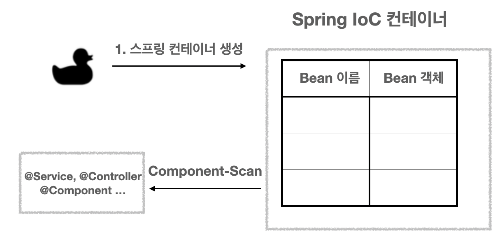
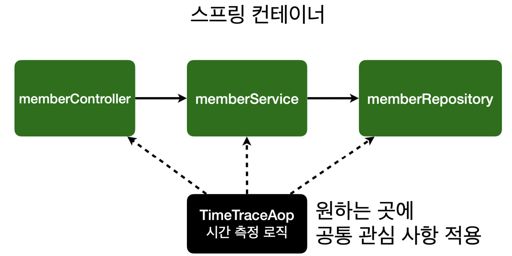
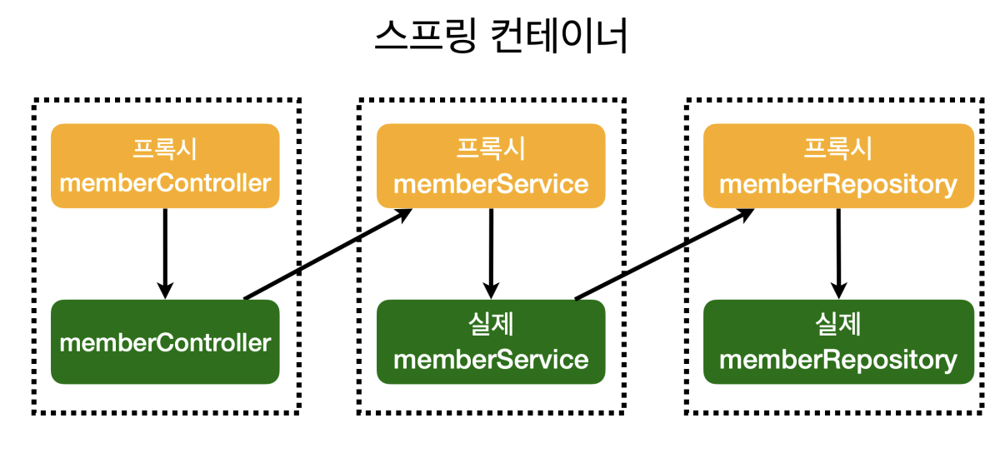

# spring-tutorial-19th
CEOS 19th BE Study - Spring Tutorial

# Week 1

## DI: Dependency Injection
**먼저 이해하면 좋은 마인드**
- 의존성 주입? 의존성이라는 특별한 개념을 추가하는 것인가?
  
  -> No. 예전에는 설계할 때 의존성이라는 risky한 성질을 고려하지 못 하는 경우가 많다.(유지보수 및 동작 risk)
  
  -> 이러한 의존성이라는 성질을 **"필요할 때만"** 주입해준다.

### Dependency
- 의존성이 있다?
  
  -> 한 객체가 다른 객체를 사용한다.

  -> Controlle(API 호출)가 Service(data 연산)를 호출해서 기능하는 예시


```java
public class Controller {
    private AlphaService alphaService

    public Controller() {
        this.alphaService = new AlphaService();
    }
}
```

위의 예시는 다음과 같은 문제점을 가진다.
1. Controller와 Alphaservice가 강하게 결합되어 있다.
    - 만약 Controller가 AlphaService가 아닌 다른 클래스를 연동하고자 한다면, Controller의 생성자 변경이 필요하다.
    -> 유연성이 떨어진다.
    - 상속은 제약이 많고 확장성이 떨어지므로 피하는 것이 좋다.

2. <U>**객체**들 간의 관계가 아니라 **클래스** 간의 관계가 맺어졌다.</U>
    - 올바른 OOP 설계라면 객체들 간의 관계가 맺어져야 한다.
    - 객체들 간의 관계가 맺어졌다면, 다른 객체의 구체 클래스(AlphaService, BetaService 등)을 알지 못 하더라도, 인터페이스(Service)의 타입으로 사용할 수 있다.


### 의존성 주입(Dependency Injection)을 통한 문제 해결
- 위와 같은 문제를 해결하기 위해서 **다형성**이 필요하다.
  
  다형성 : 같은 자료형에 여러 가지 객체를 대입하여 다양한 결과를 얻어내는 성질

- Serivce라는 Interface를 통해 해결한다(Controller에서 구체 클래스에 의존하지 않게 된다).
```java
public interface Service {

}

public class AlphaService implements Service {

}
```
- 이제 Controller와 AlphaService가 강하게 결합되어 있는 부분을 Injection으로 변경해준다.

```java
public class Controller {
    private Service service;

    public Controller(Service service) {
        this.servcie = service;
    }
}
```

- Service라는 interface가 컨트롤러에 할당되어 있지만, Alpha, Beta 등 다양한 서비스가 들어올 수 있다!
  
  (Service 자리만 맡아놓고, Service에 해당하면 모든 클래스 자유롭게 탈부착 가능)

### Spring이라는 DI Container가 필요한 이유
- 그래도 변경사항이 생기면 여전히 클래스마다 돌아다니면서 다 바꿔줘야 하는 거 아님?
  
  -> 그것도 Spring으로 관리해보자.

### Bean
- 어플리케이션 실행 시점에 필요한 객체(**Bean**)을 생성하고, 의존성이 있는 두 객체를 연결하기 위해 한 객체를 다른 객체로 주입시킨다.
  
  *Bean : Spring이 관리하는 객체

```java
public class BeanFactory {

    public void controller() {
        // Bean의 생성
        Product AlpahService = new Service();
    
        // 의존성 주입
        Controller controller = new Controller(AlphaService);
    }
    
}
```

- 그러면 Controller와 Service를 연결&변경 할 때 마다 일일이 클래스 파일 뒤져갈 필요 없이 Bean들의 연결 상태만 확인해주면 되겠네!
  
  (클래스마다 생성, 주입이 있는 것이 아니라, Bean들의 연결을 관리하는 클래스 하나에서 생성, 주입을 전부 확인할 수 있다.)

### Code에서의 적용

- @Controller 어노테이션이 있으면, 스프링 컨테이너가 해당 클래스를 bean으로 관리한다.
- service, repository  등은 하나만 생성해서 공통으로 가져다 쓰면 된다(new로 새로 만들 필요 없다).

## 정리하면: 의존성 주입이란?
- 외부에서 두 객체 간의 관계를 결정해주는 디자인 패턴
- 인터페이스를 사이에 둬서, 클래스 레벨에서는 의존관계가 고정되지 않도록 하고 런타임 시에 관계를 동적으로 주입
  
  -> 유연성 확보하고 결합도를 낮춘다.


- Controller 코드에서 constructor로 Service 연결 부분 작성하고 **@Autowired**로 스프링이 연결 관리.
    - **Issue**: 이 때 Service가 Spring에 의해 관리되지 않는 순수한 Java class라면 에러가 발생한다.
    - **Solve**: Service와 Reposisory도 각각 어노테이션(@)으로 스프링 bean 등록.
- DI에는 필드 주입, setter 주입, 생성자 주입 [3가지 방법](https://ceos19th.notion.site/7e4ac16678c44de4a6035bf799a786ae)이 있다.
- 의존관계가 실행중에 동적으로 변하는 경우는 거의 없으므로 생성자 주입을 권장한다.
- 실무에서는 주로 정형화된 컨트롤러, 서비스, 리포지토리 같은 코드는 컴포넌트 스캔을 사용한다.
- 정형화 되지 않거나, 상황에 따라 구현 클래스를 변경해야 하면 설정을 통해 스프링 빈으로 등록한다.
    - ex. 비즈니스 로직만 있을 때

## 그럼 Spring Bean은 어떻게 등록하죠?
크게 2가지 방법이 있다. 하나는 **직접 등록**하는 것이고, 하나는 **Componenet Scan**이다.
직접 등록하는 경우도 있지만, 대부분 Componenet Scan으로 커버된다.

### 1. Componenet Scan
- **@Component** 어노테이션이 있으면 Spring이 시작될 때 스프링 빈으로 자동 등록된다.
- **@Component**를 포함하는 다음 어노테이션도 스프링 빈으로 자동 등록된다.
    - **@Controller**
    - **@Service**
    - **@Repository** 

```java
@Controller // <- 이렇게 annotation 붙이면 자동 등록
public class Controller {
    private Service service;

    public Controller(Service service) {
        this.servcie = service;
    }
}
```
### Annotation 이란?
- 메타 데이타이기 때문에 비즈니스 로직에 직접적인 영향을 주지 않는다.
- but, 이 메타데이터 정보에 따라서 실행 흐름을 변경할 수 있는 코딩이 가능하여 단지 어노테이션 추가만으로 더 깔끔한 코딩이 가능하다.
- Java가 기본 제공하는 @Override 등과 같이 **"@"**로 선언할 수 있으며, Custom annotation도 만들 수 있다.

### 2. 직접 등록
- **@Configuration** 어노테이션으로 설정 파일에 등록

```java
package hello.hellospring; 

import hello.hellospring.repository.MemberRepository;
import hello.hellospring.repository.MemoryMemberRepository;
import hello.hellospring.service.MemberService;
import org.springframework.context.annotation.Bean;
import org.springframework.context.annotation.Configuration;

@Configuration
public class SpringConfig {
    @Bean
        public MemberService memberService() {
        return new MemberService(memberRepository());
    }
    @Bean
        public MemberRepository memberRepository() {
        return new MemoryMemberRepository();
    }
}
```

## Bean Life Cycle
그럼 Bean은 어떻게 Spring에서 동작하는가?

<div align="center">
  
</div>

Bean 생성 및 소멸시 다양한 콜백이 있지만 일단,
**Spring이 시작시 Bean들이 생성 및 등록되어서 사용(DI)된 후 Spring이 종료되기 전에 소멸된다.**
정도로 이해하면 충분하다.

## IoC: Inversion of Control
제어의 역전 역시 어렵지 않다.
- 우리(개발자)가 일일이 객체를 생성하고 언제 종료할지 정하지 않아도 된다.
  - Spring이 알아서 Bean life cycle 관리해주고 Componenet들도 DI로 관리
  - Spring 철학대로만 개발하면 객체들은 Spring이 관리해준다.
  - 제어를 일일이 우리가 하지 않아도 되네? == 제어의 역전

## AOP: Aspect Oriented Programming

**AOP가 필요한 상황?**
- if, 모든 메소드의 호출 시간을 측정하고 싶다면?
- 공통 관심 사항(cross-cutting concern) vs 핵심 관심 사항(core concern)
- 회원 가입 시간, 회원 조회 시간을 측정하고 싶다면?  

  -> 비슷한 기능이어도 회원 가입, 회원 조회마다 새로운 측정 기능을 부착해야 함(중복성)

<div align="center">
  
</div>

- 시간 측정 로직을 각 Component마다 집어넣었는데, 측정 단위를 수정해야 한다면?
  ex) s -> ms

  -> 일일이 Component마다 변경해야 함(번거로움)
  
**Problems**
- 회원가입, 회원 조회에 시간을 측정하는 기능은 **핵심 관심 사항이 아니다.**
- 시간을 측정하는 로직은 **공통 관심 사항**이다.
- 시간을 측정하는 로직과 핵심 비즈니스의 로직이 섞여서 **유지보수가 어렵다.**
- 시간을 측정하는 로직을 **별도의 공통 로직으로 만들기 매우 어렵다.**
- 시간을 측정하는 로직을 변경할 때 **모든 로직을 찾아가면서 변경해야 한다.**

**Solve**

공통 관심 사항(cross-cutting concern) & 핵심 관심 사항(core concern) 분리해 보자

<div align="center">
  
</div>

- 회원가입, 회원 조회등 핵심 관심사항과 시간을 측정하는 공통 관심 사항을 분리한다.
- 시간을 측정하는 로직을 별도의 공통 로직으로 만들었다.
- 핵심 관심 사항을 깔끔하게 유지할 수 있다.
- 변경이 필요하면 이 로직만 변경하면 된다.
- 원하는 적용 대상을 선택할 수 있다.

### AOP Code Example(Time Trace)

```java
@Aspect // <- AOP 등록 annotation
@Component
public class TimeTraceAop {

    @Around("execution(* hello.hellospring..*(..))")  // <- 적용 범위 설정
    public Object execute(ProceedingJoinPoint joinPoint) throws Throwable {
        long start = System.currentTimeMillis();
        System.out.println("START: " + joinPoint.toString());

        try {
            return joinPoint.proceed();
        } finally {
            long finish = System.currentTimeMillis();
            long timeMs = finish - start;
            System.out.println("END: " + joinPoint.toString() + " " + timeMs +
                    "ms");
        }
    }
}
```
- **@Aspect** 어노테이션으로 등록
- Component Scan(**@Component**)으로 등록할 수도 있지만 Spring Config에 스프링 Bean 등록하는 것이 더 적합하다.
- **@Around** 어노테이션으로 Aspect(공통 관심 사항) 로직 적용할 경로 지정

<div align="center">
  
</div>

- 내부 동작 원리는 Proxy를 이용한다.


## Unit Test & Integration Test

### Test를 왜 관리해야 할까?
- main 메소드의 반복 실행 등 번거로움을 줄여줌(Test 관련 코드만 실행).
- 여러 테스트를 동시에 실행 및 관리할 수 있다는 이점. 
- 디버깅 포인트에 대한 인지에 도움된다.
- [테스트 코드를 왜 그리고 어떻게 작성해야 할까?](https://tech.inflab.com/20230404-test-code/)
- JUnit 프레임워크를 이용한다. 

### Caution
- 모든 테스트는 순서에 상관없이(순서에 의존하지 않게) 설계해야 한다.
- 이를 위해 **@BeforeEach**로 repository를 setting하고, **@AfterEach** 등으로 repository를 clear한다.
- 아래는 DI를 적용한 단일 MemberService에 대한 Test code 예시이다.

### Unit Test(w/ DI) example  
```java
class MemberServiceTest {

    MemberService memberService;
    MemoryMemberRepository memberRepository;

    @BeforeEach
    public void beforeEach() {
        memberRepository = new MemoryMemberRepository( );
        memberService = new MemberService(memberRepository);
    }

    @AfterEach
    public void afterEach() {
        memberRepository.clearStore();
    }

}
```

- 단위 테스트는 외부 라이브러리의 영향을 받지 않는 경우도 있기 때문에, Unit Test만으로는 exception control을 완벽하게 수행하기 힘들다.

## Integration Test
- 통합 테스트는 단위 테스트와 달리 개발자가 변경할 수 없는 부분(ex. 외부 라이브러리)까지 묶어 검증할 때 사용한다.
- DB에 접근하거나 전체 코드와 다양한 환경이 제대로 작동하는지 확인하는데 필요한 모든 작업을 수행할 수 있다.

### Annotation for Integration Test

- **@SpringBootTest**: 통합 테스트를 제공하는 기본적인 스프링 부트 테스트 어노테이션
  - 실제 구동되는 애플리케이션과 똑같이 ApplicationContext를 로드하여 테스트.

- **@Transactinal**
  - 테스트 메서드에 @Transactional을 사용하면 트랜잭션으로 감싸지며, 메서드가 종료될 때 자동으로 롤백된다. 
- **@Autowired**
  - 알아서 의존 객체(Bean)을 찾아서 주입한다

- Test Case는 필요한 것만 Injection해서 쓰고 끝나기 때문에, 필드 기반 @Autowired 받는 것도 좋다.

### Integration Test(@Autowired)
- @Transactional을 이용하여 DB 롤백
  - @AfterEach DB clear 작업이 필요없다.
  - 보통 테스트용 DB를 따로 구축한다.

- 아래는 위의 Unit Test code를 **@Autowired** 어노테이션을 이용해 간략화한 예시이다.

```java
@SpringBootTest
@Transactional
class MemberServiceIntegrationTest {

    @Autowired MemberService memberService;
    @Autowired MemberRepository memberRepositoy;
}
```


## References
- [[Spring] 의존성 주입(Dependency Injection, DI)이란?](https://mangkyu.tistory.com/150#recentEntries)
- [Annotation](https://advenoh.tistory.com/21)
- [Component Scan](https://velog.io/@hyun-jii/%EC%8A%A4%ED%94%84%EB%A7%81-component-scan-%EA%B0%9C%EB%85%90-%EB%B0%8F-%EB%8F%99%EC%9E%91-%EA%B3%BC%EC%A0%95)
- [PSA](https://sabarada.tistory.com/127)