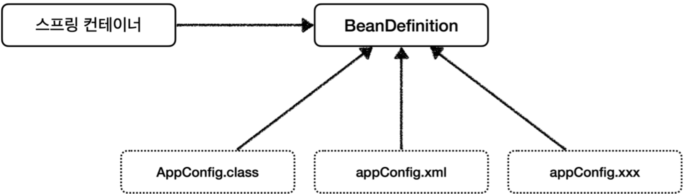

# spring-tutorial-19th
CEOS 19th BE Study - Spring Tutorial

## Spring 은 무엇일까?
스프링은 자바를 사용하여 어플리케이션을 만들 때, 더 빠르고, 쉽고, 안전하게 만들 수 있도록 도와주는 프레임워크이다.

자바는 객체지향 언어이므로, 객체지향의 특징을 어플리케이션에 적용할 때, 스프링을 사용하면 도움이 된다고 이해했다.

## Spring의 개발 배경
스프링의 핵심 개발자들이 쓴 `Professional Spring Framework` 라는 책에 이런 문구가 있다.

    💡 스프링의 정수는 엔터프라이즈 서비스 기능을 POJO에 제공하는 것

`엔터프라이즈 서비스 기능`은, `기업에서 상업적 용도로 활용이 가능한 수준의 개발 기능` 이라고 이해하였다.   

그렇다면 `POJO`는 무엇일까?

### POJO
**Plain Old Java Object**

POJO는 오래된 방식의 순수 자바 객체라는 의미라고 한다.   
나는 이 말을 `각종 라이브러리나 프레임워크같은 군더더기가 붙지 않은 순수 자바 코드` 라고 이해했다.

예시로 아래와 같은 자바 객체가 있다.

```java
public class Student {
    private String name;
    private int age;

    public Student(String name, int age) {
        this.name = name;
        this.age = age;
    }

    public String getName() {
        return name;
    }
    public int getAge() {
        return age;
    }
    
    public void setName(String name) {
        this.name = name;
    }
    public void setAge(int age) {
        this.age = age;
    }
}
```

위와 같이 순수 자바 객체는 `생성자`, `필드`, `Getter`, `Setter` 로 구성되어있다.
이런 순수 자바 객체는

    객체지향적인 원리에 충실하면서, 환경과 기술에 종속되지 않고, 필요에 따라 재활용될 수 있는 방식으로 설계된 오브젝트

이다.

자바라는 언어의 기본에만 충실한 객체이므로 어떤 라이브러리, 어떤 프레임워크에 들어가도 사용가능한 객체라는 점에서 `기술과 환경에 종속되지 않는다` 라고 표현했다고 이해했다.
그리고 이로 인해 아래와 같은 장점을 가진다.   
(이 장점은 POJO가 되기 위한 조건이기도 하다.)

1. 특정 기술과 환경에 종속되지 않으므로, **더 깔끔한 코드**가 된다.
2. 특정 기술과 환경에 종속되지 않으므로, **자동화된 테스트**를 작성하기 쉽다.
3. 특정 기술과 환경에 종속되지 않으므로, **객체지향적 설계를 자유롭게 적용**할 수 있다.

### POJO Framework
POJO 프레임워크는 POJO프로그래밍이 가능하도록 기술적 기반을 제공하는 프레임워크를 의미한다.

POJO프로그래밍이 가능하다는 말은 겉보기에 POJO만으로 개발한 것처럼 보일 정도로 **POJO코드 이외의 코드를 거의 작성하지 않아도 된다**는 뜻으로 이해하였다. 

그리고 스프링 프레임워크는 대표적인 POJO Framework 이다.


따라서 스프링을 활용하면 엔터프라이즈 기능을 제공하기 위한 복잡한 기술은 프레임워크 뒤로 숨기고, 개발자는 POJO 기반의 코드를 사용하여 비즈니스 로직만 작성하여 엔터프라이즈 어플리케이션을 만들 수 있게 된다.

## Spring의 특징


위 그림은 스프링의 핵심 개념을 설명하는 스프링 삼각형 이미지이다.

POJO를 기반으로 작성한 어플리케이션 로직 코드에 스프링의 3대 프로그래밍 모델인 `IoC/DI`, `AOP`, `PSA`를 제공하는 것을 의미한다.   

1. **제어의 역전 (IoC: Inversion of Control)**   
    스프링은 프레임워크 내에서 사용하는 객체(Bean)를 직접 관리한다.   
    객체의 생성, 소멸과 같은 Life Cycle을 관리하고, Spring 컨테이너에서 필요한 객체를 가져와 사용한다.</br>   
    이처럼 객체의 제어(생성, 소멸)를 개발자가 아닌 프레임워크에 위임하는 특징을 '제어의 역전' 이라고 한다.   

    이 개념을 구현한 것이 `IoC Container` 로, IoC Container가 Bean을 관리하고 주입한다. </br>

    IoC 컨테이너의 역할은 아래와 같이 정리할 수 있다. </br>
   1. **Bean 관리**   
      어플리케이션에서 사용하는 객체인 Bean을 생성하고 관리한다.   
      개발자는 빈의 생성과 소멸 등의 관리는 신경쓰지 않아도 된다.
      
   3. **의존성 주입 (DI)**   
        Bean 사이의 의존 관계를 보고 필요한 의존성을 주입한다.
      
   5. **Bean 라이프 사이클 관리**   
        Bean의 생성과 소멸을 관리하고, 각 시점마다 콜백 메서드를 제공한다.
      
   7. **어플리케이션 설정 관리**   
        설정값은 xml, java class, 어노테이션 등의 방법으로 적용할 수 있다.

   <br/>
   스프링에서는 IoC 컨테이너를 `ApplicationContext` 인터페이스를 구현한 클래스를 사용하여 만든다.<br/>
   (`BeanFactory`를 이용하는 경우도 있다.    
    `BeanFactory`는 `ApplicationContext` 의 상위 인터페이스로 부가 기능을 제외하고 `Bean` 관리 핵심 기능만을 가진 인터페이스다.)      
   이 클래스를 이용해 구현한 IoC 컨테이너를 `스프링 컨테이너` 라고 부른다.


2. **의존성 주입 (DI: Dependency Injection)**   
    먼저 '의존성' 이란 무엇일까?
    
    ```
    전체는 항상 부분에 의존한다.
    ```
    
    크고 복잡한 개념은, 작고 단순한 개념들에 의존한다.   
    예를 들어 컴퓨터를 새로 맞추기 위해서는 CPU, 메모리, 메인보드, 파워와 같은 부품이 필요하다.</br>   
    즉, 컴퓨터(전체)는 부품(부분)에 의존한다.</br>
    이를 자바 클래스로는 아래와 같이 나타낼 수 있다.   
   (각 부품은 모두 인터페이스라고 하자.)

    ```java
    class Computer {
        private CPU cpu;
        private Memory memory;
        ...
   
        public Computer() {}    
    }
    ```
    
    이제 인텔 CPU와 삼성 메모리를 사용해서 컴퓨터를 맞춘다고 해보자. (컴퓨터 객체 생성)

    ```java
    class Computer {
        private CPU cpu;
        private Memory memory;
        ...
   
        public Computer() {
            cpu = new IntelCpu();
            memory = new SamsungMemory();
            ...
        }    
    }
    ```
    
    위처럼 생성자를 작성한 경우에는 컴퓨터와 부품 사이에 결합도가 강해지게 된다.    
    만약 CPU를 AMD 모델로 바꿔야 하는 상황이라면 생성자에 작성했던 코드를 일일히 수정해야 한다.   

    ```java
    class Computer {
        private CPU cpu;
        private Memory memory;
        ...
   
        public Computer() {
            // cpu = new IntelCpu();
            cpu = new AmdCpu();
            memory = new SamsungMemory();
            ...
        }    
    }
    ```
    
    이는 마치 메인보드에 온보드 형식으로 CPU를 결합한 것과 비슷하다.   
    CPU를 바꿔야 할 때마다, 새로운 CPU 브랜드가 생길 때마다 생성자를 직접 수정해주어야 한다.   
    이런 코드는 확장성이 떨어지는 문제가 있다.</br></br>

    이를 해결하기 위해 데스크탑에서 사람이 끼우듯 CPU를 외부에서 직접 주입하는 방법을 사용할 수 있다.   
    이처럼 필요한 의존성을 외부에서 주입하는 것을 `의존성 주입`이라고 한다.</br></br>
    의존성 주입은 IoC를 구현하기 위해 IoC컨테이너가 수행하는 하나의 '행위'로서 IoC의 하위 개념이다. </br></br> 

    의존성을 외부에서 주입하는 방법에는 크게 3가지가 있다.</br></br>   

    1. 생성자 주입
        ``` java
        public Computer(CPU cpu, Memory memory, ...) {
            this.cpu = cpu;
            this.memory = memory;
            ...
       }
       ```
       생성자를 통해 cpu를 외부에서 주입받으므로, Computer를 클래스를 작성할 때는 어떤 CPU를 사용해야하는지 고민할 필요가 없다.</br></br>
    2. Setter 주입
        ``` java
        public class Computer {
            private CPU cpu;
            ...
        
            public void setCPU(CPU cpu) {
                this.cpu = cpu;
            }
        }
       
        Computer desktop = new Computer();
        desktop.setCPU(new IntelCpu());
        ```
    3. 필드 주입
        ``` java
        class Computer {
            @Autowired
            private CPU cpu;
            private Memory memory;
            ...
        }
       ```
       `@Autowired` 어노테이션을 이용하여 IoC 컨테이너로부터 직접 주입받는다.</br>
        이를 위해서는 주입할 CPU 객체를 Bean으로 등록해야한다.   
        Bean으로 등록된 객체는 IoC컨테이너에 의해 관리된다.
        ``` java
        @Bean
        class IntelCpu implements CPU {
            ...
        }
       ```
       필드 주입은 한번 주입된 객체가 변하지 않을 때 적합하다.</br></br>
        
3. **AOP**   
    **Aspect-Oriented Programming (관점지향 프로그래밍)**
    
    관점지향 프로그래밍은 객체지향 프로그래밍을 보완하는 개념이다.   
    객체지향이 어플리케이션의 핵심 기능을 클래스로 나누었다면, 관점지향은 여러 핵심 기능들에서 공통적으로 나타나는 부가기능(로직)을 '관점(aspect)'으로서 분리하는 것을 말한다.
    <br/><br/>   
    
    예를 들어서 Factorial을 계산하기 위해 Factorial 인터페이스를 상속하여, 반복문으로 계산하는 BasicFact 클래스와 재귀로 계산하는 RecursiveFact 클래스가 있다고 해보자.
          
      ```java
      class BasicFact implements Factorial {
          @Overide
          public long calculate(final long num) {
              // 반복문으로 계산
          }
      }  
             
      class RecursiveFact implements Factorial {
          @Overide
          public long calculate(final long num) {
              // 재귀로 계산
          }
      }  
      ```
             
      이 상황에서 중간에 실행시간을 측정해달라는 요구사항이 생겼다고 해보자.   
      실행 시간 측정은 반복문으로 factorial 을 구하는 것과, 재귀로 factorial 을 구하는 핵심 기능에 공통으로 필요한 부가 기능이다. </br></br>
                
      이 공통 부가기능을 모듈화하여 분리하는 것이 관점지향 프로그래밍이며, 공통 부가기능을 `횡단 관심사` 라고 부른다.<br/><br/>
                
      AOP와 관련된 용어로는 target object, aspect, advice, join point, pointcut 이 있다.   
      각각에 대해 정리하면 아래와 같다.<br/><br/>
                
      - target object : 부가 기능을 부여할 대상 (BasicFact, RecursiveFact)
      - aspect : advice, pointcut 정보를 가지고 AOP의 기본 모듈이 되는 단위
      - advice : 제공할 부가 기능 (실행시간 측정)
      - join point : advice가 적용될 수 있는 전체 대상
      - pointcut :  join point 중 advice를 적용할 대상을 선별하는 작업 (calculate 라는 메서드에만 적용하겠다)

      </br>   
   
      **AOP를 구현하는 방법**   
        AOP는 결과적으로 핵심 로직 사이에 부가 로직을 끼워넣는 것이다.   
        부가 로직을 언제/어떻게 끼워넣는 지에 따라 크게 3가지로 나뉜다.
         </br>
          
          1. 컴파일 시점에 코드에 삽입 
          2. 클래스 로딩 시점에 바이트 코드에 삽입 
          3. 런타임 시점에 프록시 객체를 생성하여 삽입
        
      이때 스프링은 3번 방식을 채택하여 구현하고 있다.  <br/><br/>

      ```java
      @Component
      class BasicFact implements Factorial {
          @Overide
          public long calculate(final long num) {
              // 반복문으로 계산
          }
      }  
      
      @Component
      class RecursiveFact implements Factorial {
          @Overide
          public long calculate(final long num) {
              // 재귀로 계산
          }
      }  
      ```
      AOP를 스프링에서 사용하려면 부가로직을 적용할 대상을 @Component 어노테이션을 사용해 빈으로 등록해주어야 한다.

      ```java
      @Component
      @Aspect
      class ExecutionTimeAspect {
          @Pointcut("execution(...)") // join point 중에서 aspect 를 적용할 point 선별 로직
          private void publicTarget() {}
          
          @Around("publicTarget()")  // Advice
          public Object measure(...) {
            // 실행시간 측정 로직
          }
      }
      ```  
      부가 기능을 정의한 Aspect 를 @Aspect 어노테이션을 사용해 만들어주고, Aspect 클래스 역시 빈으로 등록해준다.   
      @Pointcut 어노테이션으로 pointcut을 정의해준다.<br/><br/>
      
      스프링에서는 Advice를 Around, Before, After Returning, After Throwing, After로 구현하여,   
      메서드의 실행 시점을 기준으로 언제 부가기능을 실행할 지 정확한 시점을 같이 정의할 수 있다.
      </br></br>
4. **PSA**   
    **Portable Service Abstraction (일관성있는 서비스 추상화)**<br/><br/>
    
    Service Abstraction 은 마치 `@Transactional` 어노테이션을 사용한 것만으로 트랜잭션 서비스를 사용할 수 있듯이 복잡한 로직은 뒤에 숨기고 개발자에게 편의성을 제공하는 것을 말한다.
    
    여기에 더해, 스프링은 어떤 데이터베이스를 사용하더라도 JDBC라는 하나의 인터페이스로 Oracle, MySQL과 같은 여러 데이터베이스와 소통할 수 있다.<br/><br/>
    이렇게 하나의 추상화로 여러 서비스를 묶어 사용가능하도록 편의를 제공하는 것을 Portable Service Abstraction 이라고 한다.

## Spring Bean과 Bean의 Life Cycle

### Spring Bean
`Spring Bean`은 어플리케이션의 핵심을 구성하면서 **스프링 컨테이너가 관리하는 자바 객체**를 의미한다.   
`스프링 컨테이너`가 자바 객체를 관리하기 위해서는 단순 객체 정보 이외에도 몇가지 정보가 더 필요하다.    
그래서 `Bean`을 등록할 때는 이 정보들을 `스프링 컨테이너`에 추가적으로 알려주어야 한다.

이 추가적인 정보는 `스프링 컨테이너`를 생성할 때 `AppConfig class`, `xml` 등의 방법을 통해 전달한다.   
그러면 `스프링 컨테이너`가 생성될 때 해당 정보를 토대로 `Bean`을 컨테이너에 등록한다.    
그리고 `Bean`이 가져야 할 정보를 기술한 인터페이스가 `Bean Definition` 이다.



즉, `스프링 컨테이너`를 생성하려면, 각 `Bean`이 가져야 하는 정보를 나타내는 `BeanDefinition`이 필요하고,   
`BeanDefinition`형식에 맞게 실제로 넣을 정보는 `AppConfig.class`, `xml` 등의 방법으로 넣으면 된다. 

`Bean`을 등록할 때 필요한 정보는 크게 `bean name` 과 `bean object` 가 있다.   
마치 교실에서 학생들을 관리하기 위해 출석부에 이름을 적어두는 것처럼, `스프링 컨테이너`는 `bean object`가 가진 이름을 이용하여 관리한다.   
따라서 `bean name`은 중복되지 않게 지어야 한다.
 
### Bean LifeCycle
`Bean`은 `스프링 컨테이너`에 의해 생성, 주입, 소멸된다.   
따라서 각 빈은 생성될 때부터 소멸될 때까지 하나의 Life Cycle을 가지게 된다.   

```
스프링 컨테이너 생성 → 스프링 빈 생성 → 의존 관계 주입 → 초기화 콜백 → 사용 → 소멸 전 콜백 → 스프링 종료
```

여기에서 `스프링 빈 생성 → 의존 관계 주입` 단계는 구분 되어있지만, 만약 생성자를 이용해 의존관계를 주입하는 경우, 하나의 단계로 진행된다.   

초기화 콜백, 소멸 전 콜백을 등록하는 방법은 크게 3가지가 있다.
1. 콜백 인터페이스를 상속하여 Bean 클래스 작성
2. 설정 정보에 초기화 콜백과 소멸 전 콜백을 등록
3. Bean 클래스 내에서 어노테이션을 사용하여 콜백 메서드 작성
 
## 스프링 어노테이션
### 자바 어노테이션
어노테이션은 소스코드에 메타데이터를 삽입하는 것으로, 일종의 부가정보를 표시하는 **라벨**과 같다.   
예를 들어 `Apple` 클래스에 `@CanSale` 어노테이션을 달아주었다고 해보자.  
```java
@CanSale
public class Apple {
    ...
}
```
이렇게 라벨링을 해둔 뒤, 나중에 상품 판매 로직에서 `@CanSale` 어노테이션이 붙은 클래스만 판매가능하게 하는 로직을 넣을 수 있다.

어노테이션은 어디에 붙일지 정하는 `Target`과 언제까지 붙일지 정하는 `Retention` 에 대한 정보를 갖고 있다.   
`Retention`을 이용하여 컴파일타임까지만 붙일지, 자바 리플렉션을 이용하여 런타임까지 붙일지 등을 정할 수 있다.   
어노테이션을 이용하면 AOP를 조금 더 쉽게 구현할 수 있다.

자바의 어노테이션에는 크게 3가지가 있다.

1. 표준 어노테이션
    자바에서 기본적으로 제공하는 어노테이션으로 `@Overide`, `@Deprecated`, `@SuppressWarning` 이 있다.
2. 메타 어노테이션
    커스텀 어노테이션을 만들 때 사용하는 어노테이션 (어노테이션을 위한 어노테이션) 으로
    `Target`, `Retention`, `@Documented`, `@Inherited`, `@Repeatable` 등이 있다. 
3. 커스텀 어노테이션
    ```java
   @interface AnnotationName {
        DataType dataName();
        DataType2 dataName2() default defaultValue;
   }
   ```
   
    위와 같은 형식으로 생성할 수 있다.
    어노테이션을 붙일 때는 어노테이션 괄호로 넘길 데이터를 명시하여 넘겨준다.      
    어노테이션 내 data가 1개라면 이름을 명시하지 않아도 된다.
    ```java
   @AnnotationName(dataName=data)
   class X {
        ...
   }
   ```

### 어노테이션을 사용한 Bean 등록
빈을 등록하는 방법에는 2가지가 있다.
1. @Configuration, @Bean
    빈으로 등록할 메서드를 `@Bean` 어노테이션과 함께 기술하여, `@Configuration` 어노테이션이 붙은 설정 파일에 기술한다.
    ```java
    @Configuration
    public class AppConfig {
    
        @Bean
        public MemberService memberService() {
            return new MemberServiceImpl(memberRepository());
        }
    
        @Bean
        public OrderService orderService() {
            return new OrderServiceImpl(memberRepository(), discountPolicy());
        }
    
        @Bean
        public MemberRepository memberRepository() {
            return new MemoryMemberRepository();
        }
    }
   ```
2. @Component, @ComponentScan       
    하지만 이렇게 설정 파일을 사용하여 빈을 등록하면 빈으로 등록하고 싶은 클래스가 생길 때마다 매번 추가해주어야 한다.   
    이를 좀 더 편리하게 할 수 있는 수단으로 Component Scan 이 있다.

    `@ComponentScan` 어노테이션을 `@Configuration` 어노테이션이 붙은 설정 파일에 추가해준다.   
    `@ConmenentScan` 이 붙으면 해당 설정파일을 이용해 스프링 컨테이너가 생성될 때 `@Component` 어노테이션이 붙은 클래스를 모두 찾아 `Bean`으로서 등록해준다.   
    이때 탐색의 범위는 기본값으로 `@ComponentScan` 을 붙인 설정 파일이 존재하는 패키지가 시작위치가 되어, 해당 패키지의 모든 클래스를 탐색하게 된다.   

    또한 `@ComponentScan`은 스프링 부트에서는 `@SpringBootApplication` 어노테이션을 통해 수행된다.

## 단위 테스트와 통합 테스트
위키백과에 따르면 단위 테스트와 통합 테스트의 정의는 아래와 같다.

### 단위 테스트
```
컴퓨터 프로그래밍에서 소스 코드의 특정 모듈이 의도된 대로 정확히 작동하는지 검증하는 절차다.   
즉, 모든 함수와 메소드에 대한 테스트 케이스(Test case)를 작성하는 절차를 말한다.
```

각각의 코드 조각이 여러 상황에서 그 자체만으로 잘 동작하는지 테스트 하는 것을 의미한다.   
스프링으로 본다면, Repository, Service와 같은 각각의 로직이 잘 작동하는지 테스트 하는 것과 같다.   
이렇게 작은 단위를 테스트할 때는 실제 스프링 실행 환경과 다르므로, 이를 유사하게 흉내낸 MVC 목업을 올려서 테스트한다.

### 통합 테스트
```
 단위 테스트가 끝난 소프트웨어를 결합해 가며 시험 하는 방법이다.
 단위 테스트가 끝난 모듈들을 좀 더 큰 단위의 집합으로 통합 구성한 후, 통합 테스트 계획에 따라서 테스트를 수행한다.
```

각각의 단위 테스트를 통과한 코드를 모아서 좀 더 복잡하고 큰 규모의 형태로 구성하고, 그 상태에서 테스트를 수행하는 것을 의미한다고 이해하였다.   
스프링으로 본다면, 테스트가 끝난 Repository, Service 로직을 토대로, 실제 스프링 부트를 실행시킨 것과 동일한 환경에서 스프링 컨테이너를 올린 뒤 테스트 한다.    
따라서 통합 테스트는 단위 테스트보다 테스트에 필요한 시간이 더 길다.

## 참고자료
https://spring.io/why-spring   
https://docs.spring.io/spring-framework/reference/core/beans/introduction.html   
https://docs.spring.io/spring-framework/reference/core/aop/introduction-defn.html   
https://youtu.be/hjDSKhyYK14?si=EWpV-_ZJ4q9wcVaX   
https://sabarada.tistory.com/127    
https://drcode-devblog.tistory.com/334   
https://dev-coco.tistory.com/170   
https://www.nextree.co.kr/p5864/   
https://ko.wikipedia.org/wiki/%EC%9C%A0%EB%8B%9B_%ED%85%8C%EC%8A%A4%ED%8A%B8   
https://velog.io/@calaf/SpringBoot-Controller-%EB%8B%A8%EC%9C%84%ED%85%8C%EC%8A%A4%ED%8A%B8-%ED%86%B5%ED%95%A9%ED%85%8C%EC%8A%A4%ED%8A%B8
